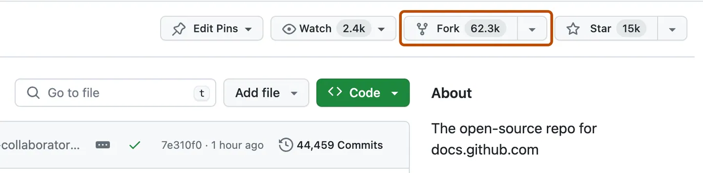

# NextJs-Study-Materials

Welcome to our **Next.js Study Project**! This repository is dedicated to learning and collaborating on various aspects of **Next.js**, a powerful React framework for building web applications.

## Project Overview

We are exploring the features of Next.js, including:
- **File-based Routing**
- **API Routes**
- **Static Generation (SSG)**
- **Server-side Rendering (SSR)**
- **Dynamic Routing**
- **Styling and CSS Support**
- **Optimizing Performance and SEO**

Our goal is to deepen our understanding of these features while building practical examples and projects.

## Folder Structure

- **/pages**: Contains the different pages and routes for the project.
- **/components**: Reusable components used throughout the project.
- **/styles**: Custom styles and CSS modules.
- **/api**: API routes for server-side functionality.

## How to Contribute
1. **Fork the repository to have your own copy of this repository in your account**:
    - Do this my Clicking the fork button on the top right section of the repository as shown in the image below:
     


2. **Clone the repository**:
    ```bash
    git clone https://github.com/your-username/nextjs-study-project.git
    ```

3. **Install dependencies**:
    ```bash
    npm install
    ```
4. **Run the development server**:
    ```bash
    npm run dev
    ```
    Open [http://localhost:3000](http://localhost:3000) to view the project in your browser.

5. **Create a branch** for your changes:
    ```bash
    git checkout -b feature/my-feature
    ```

6. **Push changes** and submit a **pull request** for review:
    ```bash
    git push origin feature/my-feature
    ```

## Learning Resources

We are referencing the official Next.js documentation as well as various tutorials to guide us through the learning process:
- [Next.js Documentation](https://nextjs.org/docs)
- [React Documentation](https://reactjs.org/docs/getting-started.html)

Feel free to contribute by adding resources, examples, or improving the project!

## License

This project is for educational purposes. All contributions are welcome!
